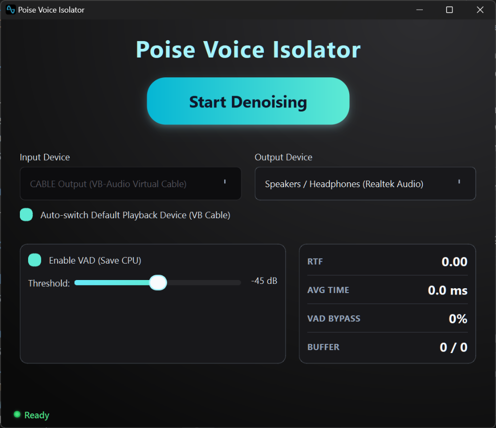

# Poise Voice Isolator

A high-performance real-time system audio denoiser and voice isolator that captures system audio, processes it through an ONNX neural network model, and outputs enhanced audio with minimal latency.



## Features

- **Real-time Processing**: Direct time-domain processing with ~10ms frame latency
- **Voice Activity Detection (VAD)**: performance boost by skipping silence
- **Low Latency**: Lock-free ring buffers for reduced latency
- **WASAPI Loopback Support**: Captures system audio on Windows using PyAudioWPatch
- **VB Cable Integration**: Automatic Windows audio device switching for seamless capture
- **Streaming State Management**: Maintains model state across frames for continuous processing
- **Automatic Resampling**: Handles different input/output sample rates seamlessly


## Installation

Currently only supported on Windows.

<span style="color:red">**Important**:</span> Make sure to download and install VB Cable to allow loopback audio capture. [Download here](https://vb-audio.com/Cable/index.htm)

### Standalone Installer (Recommended)

For the easiest experience, use the standalone Windows installer:

1. Download the Poise Installer: [Poise_Setup.exe](https://github.com/chabandou/poise-voice-isolator/releases/download/launch/Poise_Setup.exe).
2. Run the installer and follow the on-screen instructions.
3. Launch **Poise Voice Isolator** from your Desktop or Start Menu.

### Installation from Source (Developers)

Prefrebly in a seperate conda environment.

```bash
conda create -n poise python=3.9.5
conda activate poise
```

1. Clone the repository:
```bash
git clone <repository-url>
cd poise
```

2. Install required dependencies:
```bash
pip install onnxruntime numpy sounddevice scipy PyQt6

# For Windows system audio capture (recommended):
pip install pyaudiowpatch

# For better resampling performance (optional):
pip install samplerate
```

## Usage

### Quick Start

**GUI Mode:**
```bash
# Run the Poise Voice Isolator GUI
python -m stream_denoiser.gui
```

**CLI Mode:**
Process system audio with default settings (VAD enabled, automatic VB Cable switching):
```bash
# Using the modular package (recommended)
python -m stream_denoiser

# Or using the entry point script
python -m stream_denoiser.cli
```

### Programmatic Usage

The modular package can be imported and used directly:

```python
from stream_denoiser import (
    load_onnx_model,
    DenoiserAudioProcessor,
    VB_CableSwitcher,
    process_system_audio_realtime
)

# Load ONNX model
session = load_onnx_model('denoiser_model.onnx')

# Create processor
processor = DenoiserAudioProcessor(
    session,
    target_sr=48000,
    frame_size=480,
    enable_vad=True
)

# Process audio in real-time
process_system_audio_realtime(session, enable_vad=True, use_vb_cable=True)
```

### Available Options

- `--onnx`: Path to ONNX model file (default: `denoiser_model.onnx`)
- `--input-device`: Input device ID for system audio capture
- `--output-device`: Output device ID for audio playback
- `--no-vad`: Disable Voice Activity Detection
- `--vad-threshold`: VAD threshold in dB (default: -40.0, lower = more sensitive)
- `--atten-lim-db`: Attenuation limit in dB (default: -60.0)
- `--list-devices`: List all available audio devices and exit
- `--no-vb-cable`: Disable automatic VB Cable switching (use current default device)
- `--vb-cable-name`: Custom name for VB Cable device (auto-detected if not specified)

## Package Structure

```
stream_denoiser/
├── gui/                     # Poise GUI implementation
│   ├── __init__.py          # GUI package initialization
│   ├── __main__.py          # GUI module entry point
│   ├── assets/              # Icons and images
│   ├── widgets/             # Custom UI components
│   │   ├── __init__.py      # Widgets package initialization
│   │   ├── device_selector.py
│   │   ├── stats_panel.py
│   │   └── toggle_button.py
│   ├── main_window.py       # Main GUI logic
│   ├── settings.py          # Settings dialog
│   ├── styles.py            # Global QSS styles
│   ├── system_tray.py       # System tray integration
│   ├── utils.py             # GUI helper utilities
│   └── worker.py            # Audio processing thread
├── backends/                # Audio interface backends
│   ├── __init__.py          # Backends package initialization
│   ├── pyaudio_backend.py   # Windows/WASAPI support
│   └── sounddevice_backend.py # Cross-platform support
├── processor.py             # Core ONNX model wrapper
├── vad.py                   # Voice Activity Detection
├── resampler.py             # Audio resampling logic
├── ring_buffer.py           # Thread-safe audio buffering
├── vb_cable.py              # Virtual cable management
├── device_utils.py          # Audio device utilities
├── constants.py             # Global configurations
├── cli.py                   # Command-line interface
├── logging_config.py        # Central logging configuration
├── backend_detection.py     # Backend availability checks
├── __init__.py              # Package initialization
└── __main__.py              # Python module entry point
```

## Processing Flow

```
┌─────────────────┐
│ System Audio    │
│ (WASAPI/ALSA)   │
└────────┬────────┘
         │
         ▼
┌─────────────────┐
│ Input Buffer    │
│ (Ring Buffer)   │
└────────┬────────┘
         │
         ▼
┌─────────────────┐
│ Resampler       │◄─── Convert to 48kHz if needed
│ (if needed)     │
└────────┬────────┘
         │
         ▼
┌─────────────────┐
│ Frame Splitter  │◄─── 480 samples (10ms @ 48kHz)
└────────┬────────┘
         │
         ▼
┌─────────────────┐
│ VAD Check       │◄─── Skip processing if silence
│ (optional)      │
└────────┬────────┘
         │
         ▼
┌─────────────────┐
│ ONNX Inference  │◄─── Denoiser model processing
│ (with state)    │
└────────┬────────┘
         │
         ▼
┌─────────────────┐
│ Post-processing │◄─── Normalize, clip, remove DC
└────────┬────────┘
         │
         ▼
┌─────────────────┐
│ Output Buffer   │
│ (Ring Buffer)   │
└────────┬────────┘
         │
         ▼
┌─────────────────┐
│ Audio Output    │
│ (Speakers)      │
└─────────────────┘
```

## Model Requirements

The ONNX model should have the following interface:

**Inputs:**
- `input_frame`: Float32 array of shape `[480]` (480 samples @ 48kHz)
- `states`: Float32 array of shape `[45304]` (model internal state)
- `atten_lim_db`: Float32 scalar (attenuation limit in dB)

**Outputs:**
- `enhanced_audio`: Float32 array (variable length, normalized to 480 samples)
- `new_states`: Float32 array of shape `[45304]` (updated state for next frame)
- `lsnr`: Float32 scalar (optional, signal-to-noise ratio estimate)

## Statistics

During processing, the script/GUI displays real-time statistics:
- **RTF**: Real-time factor (processing time / frame duration, <1.0 means real-time capable)
- **Avg**: Average processing time per frame in milliseconds
- **VAD bypass**: Percentage of frames skipped due to silence
- **Buffer status**: Input/output buffer fill levels

## Troubleshooting

### No audio devices found
- Run `python -m stream_denoiser --list-devices` to see available devices
- On Windows, ensure `pyaudiowpatch` is installed for WASAPI loopback support

### High latency
- Reduce `BUFFER_CAPACITY_RATIO` in the code (currently 0.1 = 100ms)
- Ensure VAD is enabled to reduce processing load
- Check that your system can process frames faster than real-time (RTF < 1.0)

### Audio dropouts
- Reduce processing load (enable VAD, reduce model complexity)
- Check system CPU usage and close unnecessary applications, the model can be resource hungry.

## Special thanks to
GTCRN implementation by [here](https://github.com/Xiaobin-Rong/gtcrn#).

yuyun2000 for the speech enhancement [model](https://github.com/yuyun2000/SpeechDenoiser).


## License

MIT License

## Contributing

Contributions are welcome!


