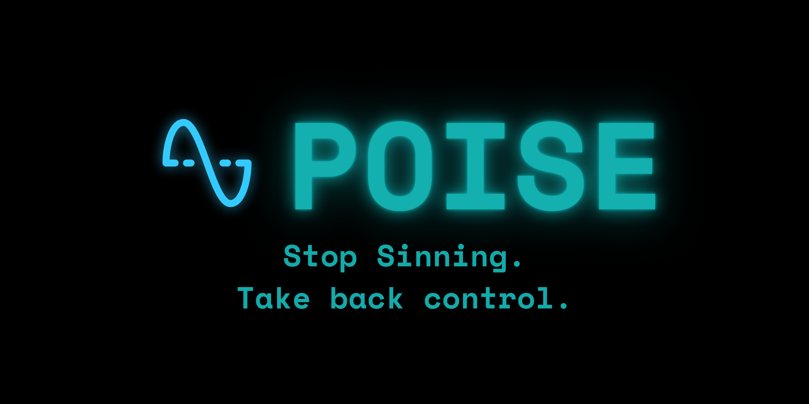
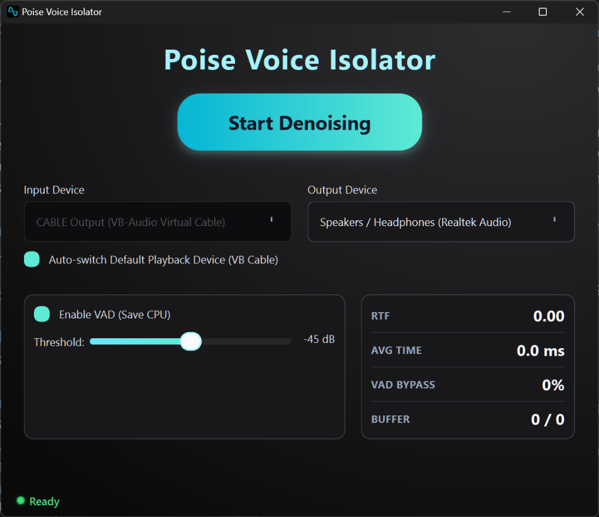

<div align="center">

</div>

<div align="center">

[](https://github.com/chabandou/poise-voice-isolator/releases)
[](https://github.com/chabandou/poise-voice-isolator/releases)
[-3DDC84?style=for-the-badge&logo=android&logoColor=white)](https://github.com/chabandou/poise-android/releases)

</div>


<div align="center">

[](https://www.python.org/)
[](LICENSE)
[](https://github.com/chabandou/poise-voice-isolator)
[](https://github.com/chabandou/poise-voice-isolator)

</div>


<div align="center">
<picture>
  <source media="(prefers-color-scheme: light)" srcset="stream_denoiser/gui/assets/calligraphy_bismillah_black.png">
  <source media="(prefers-color-scheme: dark)" srcset="stream_denoiser/gui/assets/calligraphy_bismillah.png">
  
</picture>
</div>

# Poise Voice Isolator

A high-performance real-time system audio denoiser and voice isolator that captures system audio, processes it through an ONNX neural network model, and outputs enhanced audio with minimal latency.

|Screenshot |
|---|
|  |

---

## For Users

### Why Poise?

Poise is a real-time audio filter that runs in the background while you browse, stream, or work. Simply enable it and let it automatically remove music and background noise from everything you hear - YouTube, social media, podcasts, live streams, and more.

**Key Benefits:**

- **Enable & Forget** - Turn it on once and it continuously processes all system audio in real-time
- **Instant Music Removal** - Automatically strips out music and instrumentals while preserving speech and vocals from any source
- **100% Private & Local** - All processing happens on your machine. Your audio never leaves your computer. Zero cloud dependencies. No tracking, no telemetry.
- **Halal-Friendly Alternative** - For those who practice Islamic values, easily remove musical content while preserving speech and spoken word from any online content
- **Real-time Processing** - Processes audio as it plays with only ~10ms latency, unnoticeable to the user
- **Works Everywhere** - Automatically filters system audio whether you're watching YouTube, streaming content, on video calls, or listening to podcasts
- **Completely Free & Open Source** - MIT licensed. No subscriptions. No hidden costs.

### Features

| Feature | Description |
|---------|-------------|
| **Voice Isolation** | Removes music and instrumentals, keeps only vocals and speech |
| **Real-time Processing** | Direct time-domain processing with ~10ms frame latency |
| **Voice Activity Detection** | Performance boost by skipping silence and non-speech sections |
| **Low Latency** | Lock-free ring buffers for reduced latency |
| **WASAPI Loopback** | Captures system audio on Windows using PyAudioWPatch |
| **VB Cable Integration** | Automatic Windows audio device switching for seamless capture |

### Installation

| Platform | Status |
|----------|--------|
|  | Full Support |
|  | Full Support |
|  | SAMSUNG ONLY [(poise-android)](https://github.com/chabandou/poise-android) |

#### Windows

> **Important**: Make sure to download and install [VB Cable](https://vb-audio.com/Cable/index.htm) for loopback audio capture on Windows.

1. Download the Poise Installer: [Poise_Setup.exe](https://github.com/chabandou/poise-voice-isolator/releases/download/launch/Poise_Setup.exe).
2. Run the installer and follow the on-screen instructions.
3. Launch **Poise Voice Isolator** from your Desktop or Start Menu.

#### Linux Binary

Download the prebuilt binary for the TUI directly from GitHub:

```bash
# Download the latest release
curl -L -o poise https://github.com/chabandou/Poise-Voice-Isolator/releases/download/v1.0.0/poise

# Make it executable
chmod +x poise

# Move to your PATH (optional)
sudo mv poise /usr/local/bin/

# Run the TUI
poise
```

Or on **Arch Linux**:

```bash
sudo pacman -S poise-bin

# Run the TUI
poise
```

### Troubleshooting

#### No audio devices found

- Run `python -m stream_denoiser --list-devices` to see available devices
- On Windows, ensure `pyaudiowpatch` is installed for WASAPI loopback support

#### High latency

- Reduce `BUFFER_CAPACITY_RATIO` in the code (currently 0.1 = 100ms)
- Ensure VAD is enabled to reduce processing load
- Check that your system can process frames faster than real-time (RTF < 1.0)

#### Audio dropouts

- Reduce processing load (enable VAD, reduce model complexity)
- Check system CPU usage and close unnecessary applications, the model can be resource hungry.

#### Linux Troubleshooting

##### Error: `cannot enable executable stack as shared object requires: Invalid argument`

**Fix:**
Clear the executable stack flag on the ONNX Runtime library using `execstack` or `patchelf`.

1. Install `patchelf`:

   ```bash
   sudo pacman -S patchelf    # Arch Linux
   sudo apt install patchelf  # Ubuntu/Debian
   ```

2. Locate the `onnxruntime` shared object file and clear the flag:

   ```bash
   # Find the path (example path for conda environment 'poise')
   find ~/miniforge3/envs/poise/lib/ -name "onnxruntime_pybind11_state.so"

   # Apply the fix
   patchelf --clear-execstack /path/to/onnxruntime_pybind11_state.so
   ```

---

##### Error: `malloc(): invalid size (unsorted)` or crash on startup

**Fix - Rebuild PortAudio:**

1. Install build dependencies:

   ```bash
   sudo pacman -S base-devel cmake libpulse alsa-lib   # Arch
   sudo apt install build-essential cmake libpulse-dev libasound2-dev  # Ubuntu
   ```

2. Clone and build PortAudio with PulseAudio:

   ```bash
   git clone https://github.com/PortAudio/portaudio.git /tmp/portaudio
   cd /tmp/portaudio && mkdir build && cd build
   cmake .. -DCMAKE_BUILD_TYPE=Release -DPA_USE_ALSA=ON -DPA_USE_JACK=OFF -DPA_USE_PULSEAUDIO=ON -DCMAKE_INSTALL_PREFIX=/usr/local
   make -j$(nproc)
   sudo make install && sudo ldconfig
   ```

3. Reinstall sounddevice:

   ```bash
   pip uninstall sounddevice && pip install sounddevice --no-cache-dir
   ```

4. **Important:** Set `LD_LIBRARY_PATH` before running:

   ```bash
   export LD_LIBRARY_PATH=/usr/local/lib:$LD_LIBRARY_PATH
   python -m stream_denoiser
   ```

   To make permanent:

   ```bash
   echo 'export LD_LIBRARY_PATH=/usr/local/lib:$LD_LIBRARY_PATH' >> ~/.bashrc
   ```

---

##### No audio output or echo/duplicate audio

The denoiser automatically creates a null sink to capture system audio without echo. If audio isn't working:

1. **Check current default sink:**
   ```bash
   pactl get-default-sink
   ```
2. **If stuck on `Denoiser_Capture` after a crash:**

   ```bash
   pactl set-default-sink alsa_output.pci-0000_00_1f.3.analog-stereo
   ```

   (Replace with your actual sink name from `pactl list sinks short`)

3. **Remove leftover null sink:**
   ```bash
   pactl unload-module module-null-sink
   ```

---

## For Developers

### Installation from Source

Recommended to be done in a separate conda environment.

```bash
conda create -n poise python=3.10
conda activate poise
```

1. Clone the repository:

```bash
git clone https://github.com/chabandou/poise-voice-isolator.git
cd poise-voice-isolator
```

2. Install required dependencies:

```bash
pip install onnxruntime numpy sounddevice scipy PyQt6

# For Windows system audio capture (recommended):
pip install pyaudiowpatch

# For better resampling performance (optional):
pip install samplerate
```

#### Usage

##### CLI Mode

Process system audio with default settings (VAD enabled, automatic audio device switching):

```bash
# Using the modular package (recommended)
python -m stream_denoiser

# Or using the entry point script
python -m stream_denoiser.cli
```

### Available Options

- `--onnx`: Path to ONNX model file (default: `denoiser_model.onnx`)
- `--input-device`: Input device ID for system audio capture
- `--output-device`: Output device ID for audio playback
- `--no-vad`: Disable Voice Activity Detection
- `--vad-threshold`: VAD threshold in dB (default: -40.0, lower = more sensitive)
- `--atten-lim-db`: Attenuation limit in dB (default: -60.0)
- `--list-devices`: List all available audio devices and exit
- `--no-vb-cable`: Disable automatic VB Cable switching (use current default device)
- `--vb-cable-name`: Custom name for VB Cable device (auto-detected if not specified)

##### GUI Mode (Windows only)

```bash
# Run the Poise Voice Isolator GUI
python -m stream_denoiser.gui
```

##### TUI Mode (Linux only)

```bash
# Run the Poise Voice Isolator TUI
python -m stream_denoiser.tui
```

### Package Structure

```
stream_denoiser/
├── tui/                     # Terminal UI (Linux)
│   ├── __init__.py
│   ├── __main__.py          # TUI entry point
│   ├── app.py               # Main Textual app
│   ├── styles.tcss          # TUI stylesheet
│   └── widgets/             # TUI components
│       ├── device_list.py   # Device selection widget
│       ├── stats_panel.py   # Statistics display
│       └── status_line.py   # Status bar widget
├── gui/                     # Desktop GUI (Windows, PyQt6)
│   ├── __init__.py
│   ├── __main__.py
│   ├── assets/              # Icons and images
│   ├── widgets/             # Custom UI components
│   ├── main_window.py
│   ├── settings.py
│   ├── styles.py
│   ├── system_tray.py
│   └── worker.py            # Audio processing thread
├── backends/                # Audio interface backends
│   ├── pyaudio_backend.py   # Windows/WASAPI support
│   ├── sounddevice_backend.py # Cross-platform support
│   └── platform/            # Platform-specific code
│       ├── linux.py         # PulseAudio integration
│       └── windows.py       # WASAPI support
├── processor.py             # Core ONNX model wrapper
├── vad.py                   # Voice Activity Detection
├── resampler.py             # Audio resampling
├── ring_buffer.py           # Thread-safe audio buffering
├── vb_cable.py              # Virtual cable management (Windows)
├── device_utils.py          # Audio device utilities
├── platform_utils.py        # Platform detection
├── constants.py             # Global configurations
├── cli.py                   # Command-line interface
├── logging_config.py        # Logging configuration
├── backend_detection.py     # Backend availability checks
├── __init__.py
└── __main__.py
```

### Processing Flow

```
┌─────────────────┐
│  System Audio   │
│    (Input)      │
└────────┬────────┘
         │
         ▼
┌─────────────────┐
│ Input Buffer    │
│ (Ring Buffer)   │
└────────┬────────┘
         │
         ▼
┌─────────────────┐
│ Resampler       │◄─── Convert to 48kHz if needed
│ (if needed)     │
└────────┬────────┘
         │
         ▼
┌─────────────────┐
│ Frame Splitter  │◄─── 480 samples (10ms @ 48kHz)
└────────┬────────┘
         │
         ▼
┌─────────────────┐
│ VAD Check       │◄─── Skip processing if silence
│ (optional)      │
└────────┬────────┘
         │
         ▼
┌─────────────────┐
│ ONNX Inference  │◄─── Denoiser model processing
│ (with state)    │
└────────┬────────┘
         │
         ▼
┌─────────────────┐
│ Post-processing │◄─── Normalize, clip, remove DC
└────────┬────────┘
         │
         ▼
┌─────────────────┐
│ Output Buffer   │
│ (Ring Buffer)   │
└────────┬────────┘
         │
         ▼
┌─────────────────┐
│  Audio Output   │
│   (Speakers)    │
└─────────────────┘
```

### Model Requirements

The ONNX model should have the following interface:

### Inputs

- `input_frame`: Float32 array of shape `[480]` (480 samples @ 48kHz)
- `states`: Float32 array of shape `[45304]` (model internal state)
- `atten_lim_db`: Float32 scalar (attenuation limit in dB)

### Outputs

- `enhanced_audio`: Float32 array (variable length, normalized to 480 samples)
- `new_states`: Float32 array of shape `[45304]` (updated state for next frame)
- `lsnr`: Float32 scalar (optional, signal-to-noise ratio estimate)

### Statistics

During processing, the script/GUI displays real-time statistics:

- **RTF**: Real-time factor (processing time / frame duration, <1.0 means real-time capable)
- **Avg**: Average processing time per frame in milliseconds
- **VAD bypass**: Percentage of frames skipped due to silence
- **Buffer status**: Input/output buffer fill levels

##### Audio routing (how it works)

On Linux, the denoiser:

1. Creates a null sink (`Denoiser_Capture`)
2. Sets it as the default (apps send audio there)
3. Captures from the null sink's monitor
4. Outputs processed audio to your real speakers
5. Restores original routing on exit

This eliminates echo because original audio goes to a silent null sink.

## Special Thanks

GTCRN implementation [here](https://github.com/Xiaobin-Rong/gtcrn#).

yuyun2000 for the speech enhancement [model](https://github.com/yuyun2000/SpeechDenoiser).

## License

MIT License

## Contributing

I have no specific method of contribution, but I'm open to ideas, and all contributions are welcome.

<div align="center">

### Made with care by Chabandou

[Star us on GitHub](https://github.com/chabandou/poise-voice-isolator) · [Report Bug](https://github.com/chabandou/poise-voice-isolator/issues) · [Request Feature](https://github.com/chabandou/poise-voice-isolator/issues)

</div>
